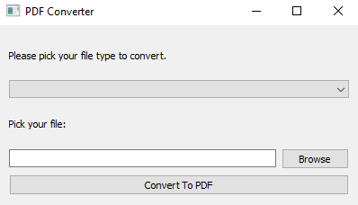

# 🧾 TXT & DOCX to PDF Converter

After a short **2-week break** (school + sickness combo 😩), I’m finally **back at it**.  
This time I built something actually useful — a **file converter app** that turns `.txt` and `.docx` files into `.pdf` with a clean GUI made in **PyQt5**.

---

## ⚙️ How It Works
1. Choose the file type (TXT or DOCX) from the dropdown.  
2. Browse and select your file.  
3. Hit **Convert to PDF**.  
4. The app instantly makes a `.pdf` version and shows a success or error popup.  

## 📦 Libraries Needed
Theres only one required library, and you can install it like this:
```bash
pip install pyqt5
```
- PyQt5 → Creates the graphical interface (buttons, dropdowns, dialogs, etc.)

IMPORTANT: This code also needs Libreoffice and for soffice.exe to be in PATH

  
## 🧠 What I Learned
- Designing and managing **GUI apps** with PyQt5  
- Working with **file dialogs**  
- Displaying **message boxes** for success/error handling  
- Handling **multiple file formats** and converting them properly  

## 💾 Download
Want to try the program directly?  
👉 [Download TXT & DOCX to PDF Converter (.exe)](https://www.mediafire.com/file/jmf48ickqzm2jqp/txt-docx-to-pdf.exe/file)

## 🖼️ Preview


## 📝 Note
Like my other projects, this is the **first version only**.  
I’m not improving or rewriting it unless it’s a really special project.  
This GitHub is meant to show my growth over time, from my earliest code to whatever I make in the future.
